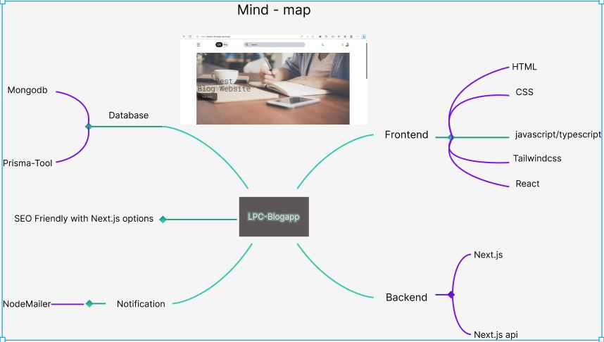

This is a [LPC-Blogapp](https://leopico-blogapp.vercel.app/) project bootstrapped with [`create-next-app`](https://github.com/vercel/next.js/tree/canary/packages/create-next-app).



### SEO report before & after

[Google Drive Link](https://drive.google.com/drive/folders/1JjqmuF0ITBtfrs6nWwj9u4-SIVWsDZ6J?usp=sharing)

### You can see below the features for this app:

- Tailwind design
- Tailwind animations and effects
- Full responsiveness
- Credential authentication
- Google authentication
- Github authentication
- Image upload using Cloudinary CDN
- Client form validation and handling using react-hook-form
- Dark mode function with next-themes
- Email verification token with NodeMailer
- Email notification system with NodeMailer when posting at Admin side
- Split function and storing data for subscriber of users
- Text editor with react-quill
- Solved rendering of client component when pre-build static generation with dynamic of next-dynamic
- Pagination algorithm for Heading posts
- utility for constructing className strings conditionally with clsx
- Server error handling using react-toast
- db seeding for initiate of admin account with ts-node
- create custom hook with zustand
- With Git version control that separate branches with separate section
- Page loading state
- Page empty state
- Posting / CRD system in Admin role
- User / Admin role authorization with next-auth
- Save / Unsave from users side
- Advanced search algorithm by posts title
  - For example we will filter out posts title that have a post and through to dynamic post route
- How to write POST and DELETE routes in route handlers (app/api)
- How to fetch data in server react components by directly accessing the database (WITHOUT API! like Magic!)
- How to handle files like error.tsx and loading.tsx which are new Next 13 templating files to unify loading and error handling
- How to handle relations between Server and Child components!

### Prerequisites

**Node version 14.x**

### Cloning the repository

```shell
git clone https://github.com/leopico/Bog-app.git
```

### Install packages

```shell
npm i
```

### Setup .env file

```js
DATABASE_URL=
NEXTAUTH_SECRET=
GITHUB_ID=
GITHUB_SECRET=
GOOGLE_CLIENT_ID=
GOOGLE_CLIENT_SECRET=
NEXT_PUBLIC_CLOUDINARY_CLOUD_NAME=
EMAIL=
EMAIL_PASS=
ACC_NAME=
ACC_EMAIL=
ACC_PASSWORD=
VERCEL_URL=
```

### Setup Prisma

```shell
npx prisma db push
npx prisma db seed
```

### Start the app

```shell
npm run dev
```

## Available commands

Running commands with npm `npm run [command]`

| command | description                              |
| :------ | :--------------------------------------- |
| `dev`   | Starts a development instance of the app |

### Demo account for admin

```shell
username - paypalmoney967@gmail.com
password - admin123
```
